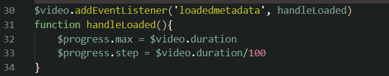
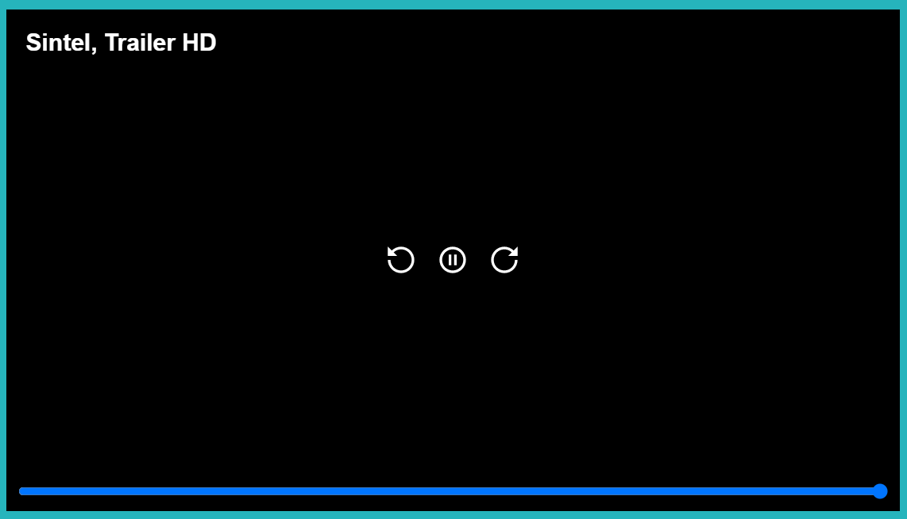
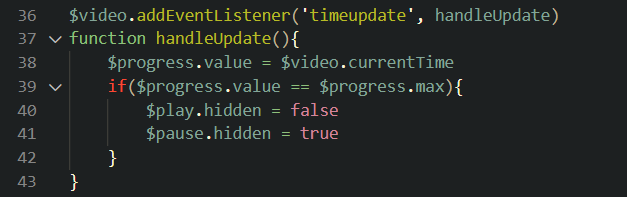
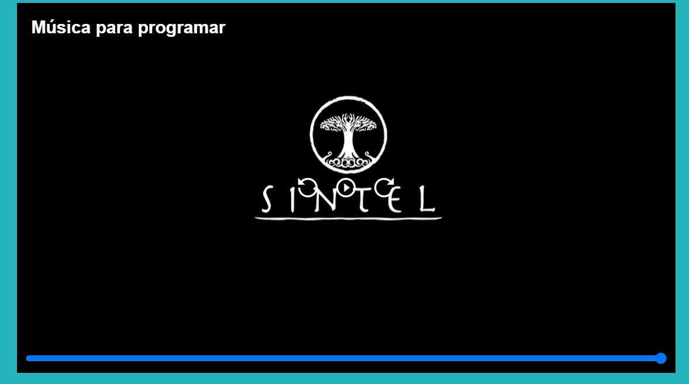

# video-player

## Modificaciones

### Input tipo rage

- Al acabar de reproducir el video en el input range quedaba un espacio en blanco.

  - 

- Para solucionar ello se agregó step del input tipo range desde la función handleLoaded().
  
  -  
  
- Quedando de la siguiente manera.

  -   
  
### Botón play y pause
  
  - Al acabar de reproducir el video el botón de pausa se seguía mostrando.
  
    - 
  
  - Para solucionar ello se agregó las siguientes líneas de código en la función handleUpdate().
  
    - 
   
  - Quedando de la siguiente manera.
  
    -
